# Introduction
[tsigoloib](https://opensea.io/tsigoloib), biologist backward is an biology and artificial intelligence inspired NFT minted on [opensea.io](https://opensea.io) polygon chain since June 2021 using Blender 3D modeling. The theme here combine the aspect of biology such as virus/disease and technology such as artificial intelligence and cyber crime. There are currently 5 collections: The new-normal, The 2nd wave of Covid19, The infected DNA, Did you wash your hands, Artificial Intelligence: Oppurtunity or Threat.

| | | | | |
|:-------------------------:|:-------------------------:| :-------------------------:|:-------------------------:|:-------------------------:|
|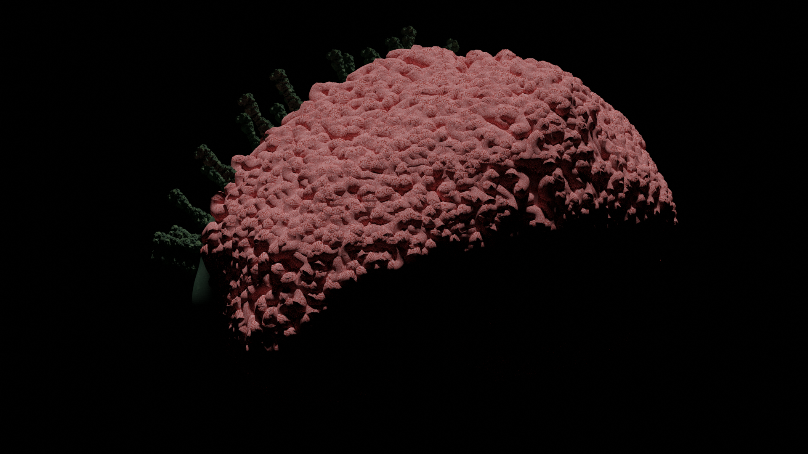 |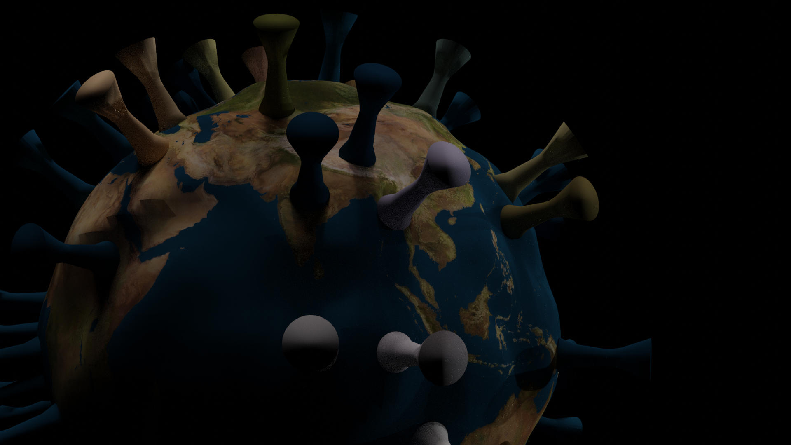 |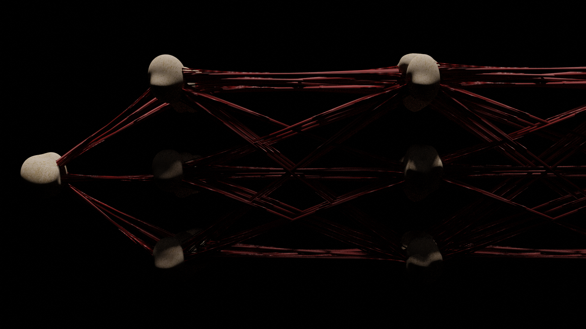 |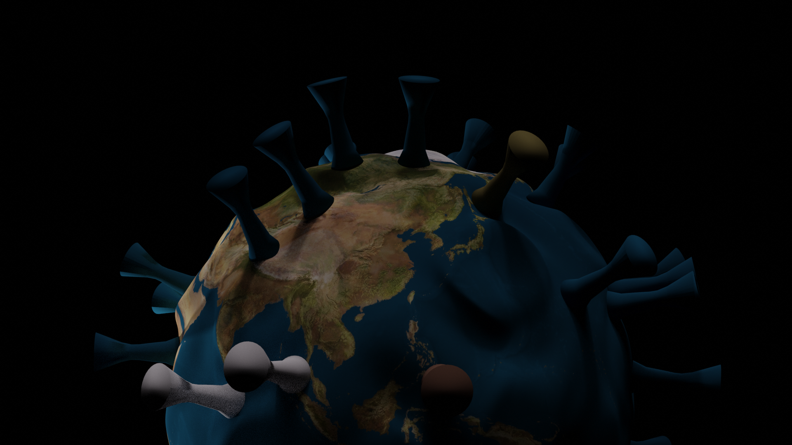 |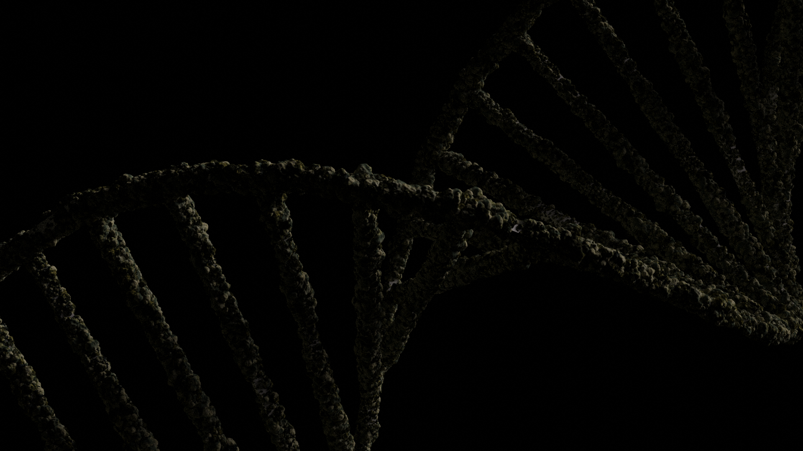 |
|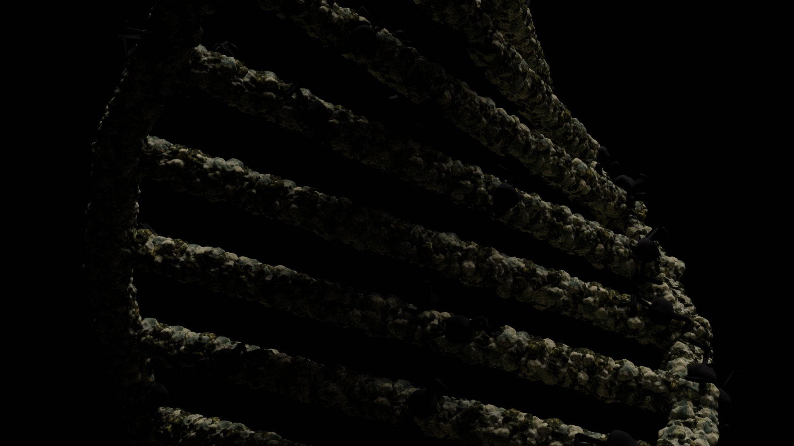 |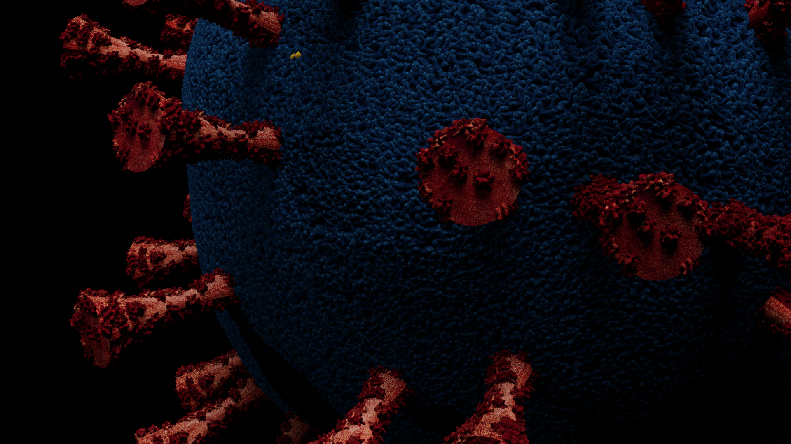| 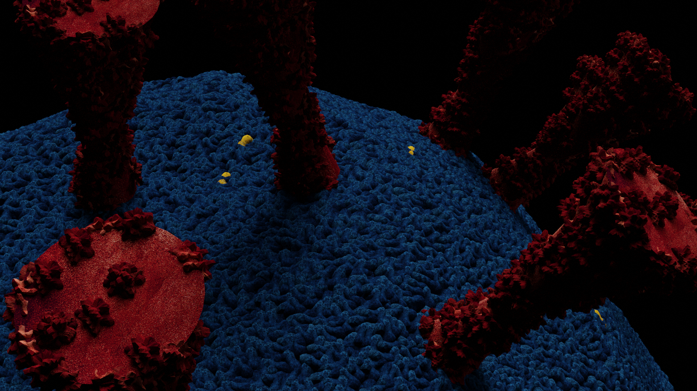 | 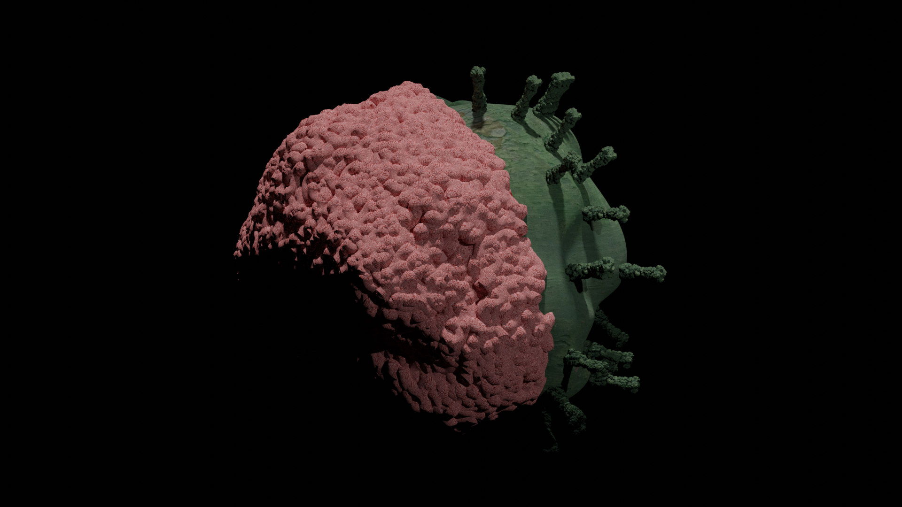 |  |
|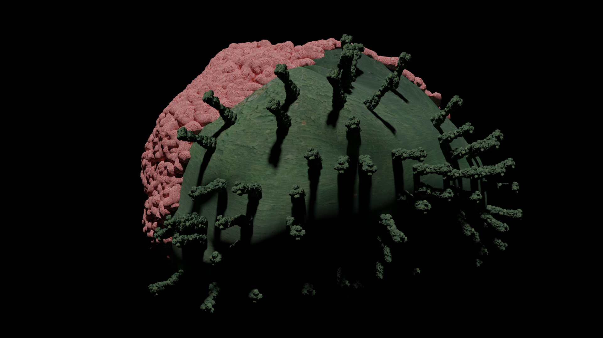 |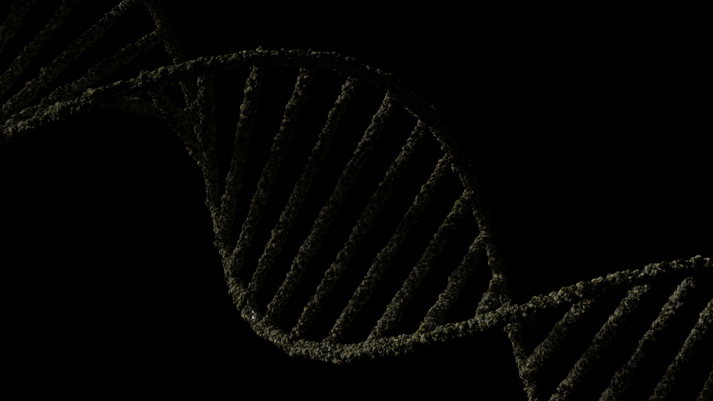 |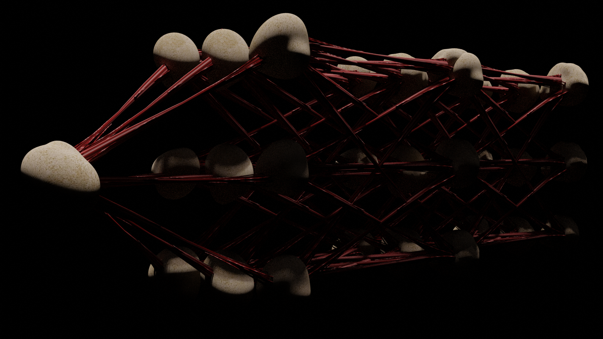 |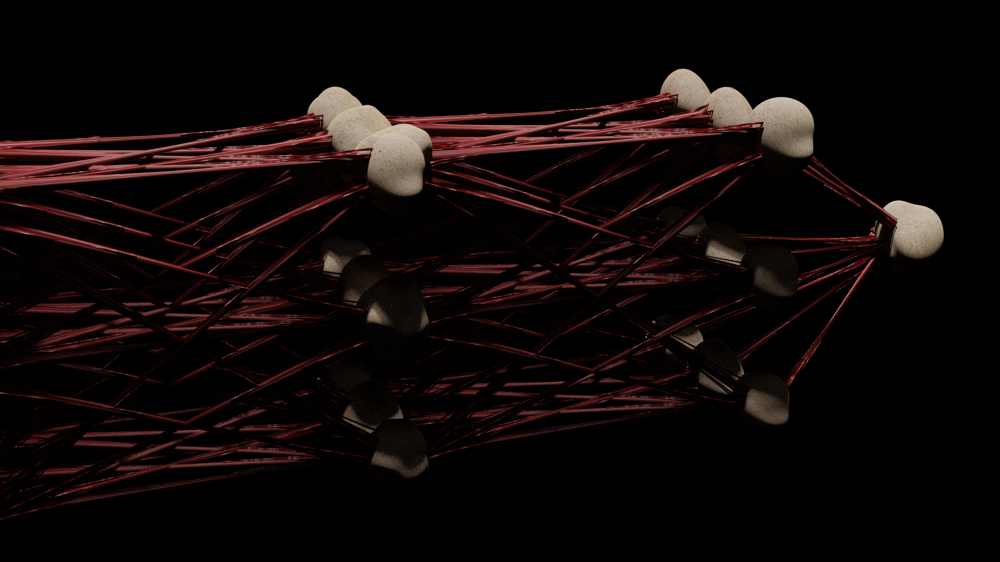 |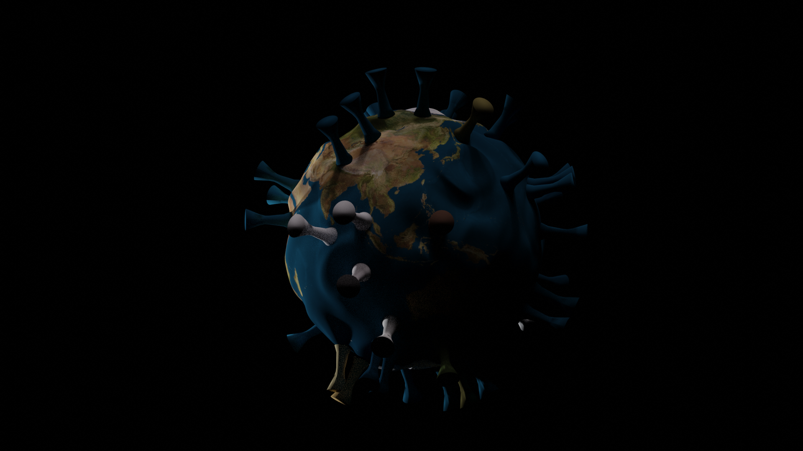 


# DeepDream

Qoute from [official website](https://www.tensorflow.org/tutorials/generative/deepdream): "DeepDream is an experiment that visualizes the patterns learned by a neural network. Similar to when a child watches clouds and tries to interpret random shapes, DeepDream over-interprets and enhances the patterns it sees in an image. The idea in DeepDream is to choose a layer (or layers) and maximize the "loss" in a way that the image increasingly "excites" the layers. Normally, loss is a quantity you wish to minimize via gradient descent. In DeepDream, you will maximize this loss via gradient ascent"

Every collection incorperate the idea of deep dreaming by passing the original image/file through pre-trained model randomly choosen from variety of [pre-trained model list](https://keras.io/api/applications/#available-models) with randomly selected layer(s) to create dream like image of the original image using DeepDreaming.py

```python
#get images in the original folder
path = os.getcwd()
path = os.path.join(path,'original_image')
file_ls = os.listdir(path)

for file_name in file_ls:  
    if file_name.split('.')[-1] == 'png':
        #my image
        image = np.array(PIL.Image.open(f'original_image/{file_name}'))[:,:,:3]
        
        #pre-trained model originally used in DeepDream
        base_model = tf.keras.applications.InceptionV3 (include_top=False, weights='imagenet')
        
        #layer ls
        layer_ls = []
        for i, layer in enumerate(base_model.layers):
           layer_ls.append(layer.name)
           
        #Maximize the activations of these layers
        names = np.random.choice(layer_ls,3)
        layers = [base_model.get_layer(name).output for name in names]
        
        #Create the feature extraction model
        dream_model = tf.keras.Model(inputs=base_model.input, outputs=layers)
        deepdream = DeepDream(dream_model)
        dream_img = run_deep_dream_simple(img=image, steps=100, step_size=0.01)
    
        #save image
        dream_img = np.array(dream_img)
        i = PIL.Image.fromarray(dream_img)
        
        layer_name = ''
        for each in names:
            layer_name += each
        new_file_name = f'DREAM_ME/{file_name.split(".")[0]}_{layer_name}.png'
        i.save(new_file_name)
```


# Did You Wash Your Hands?
Have I wash my hand? The concept of [Did You Wash Your Hands?](https://opensea.io/tsigoloib/did-you-wash-your-hands?search[resultModel]=ASSETS&search[sortBy]=LISTING_DATE) collection is to repesent the overthinking about Corona virus. The object used the overall shape of the brain with 2 different types of textures separated at the center of the shape. One side have the realistic-brain pink colour texture while the other side has the green dirty Corona virus texture to represent the feeling that we worried about the virus all the time. 

| | | 
|:-------------------------:|:-------------------------:|
| |  | 
|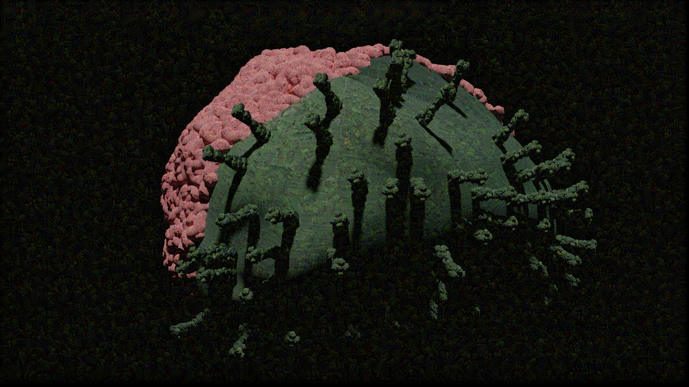   |  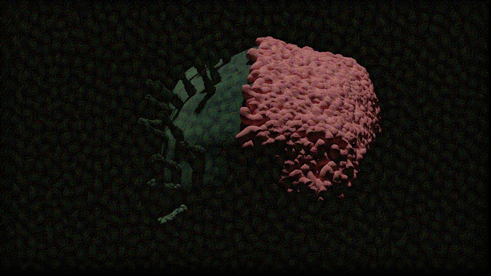 | 

# Aritificial Intelligence: Oppurtunity or Threat?
Oppurtunity or Threat? The Beginning or the End? The concept of [Aritificial Intelligence: Oppurtunity or Threat?](https://opensea.io/tsigoloib/aritificial-intelligence-oppurtunities-or-threats?search[resultModel]=ASSETS&search[sortBy]=LISTING_DATE) collection is to question whether the raise of Artificial Intelligence is the future of humanity or the end. The object represent the struture of ANN (Artificial Neural Network) in 3D which is inspired from real neural network inside human brain. Since most of the people view the AI to be the futrue of the humanity, the connection between each neuron is made with red color muscle-like texture to resemble Titan skin (attack on titan) to represent the fearness of AI destroying the humanity. The node itself is created with the bone-like texture, which is also inspired from attack on Titan.

| | | 
|:-------------------------:|:-------------------------:|
| |  | 
|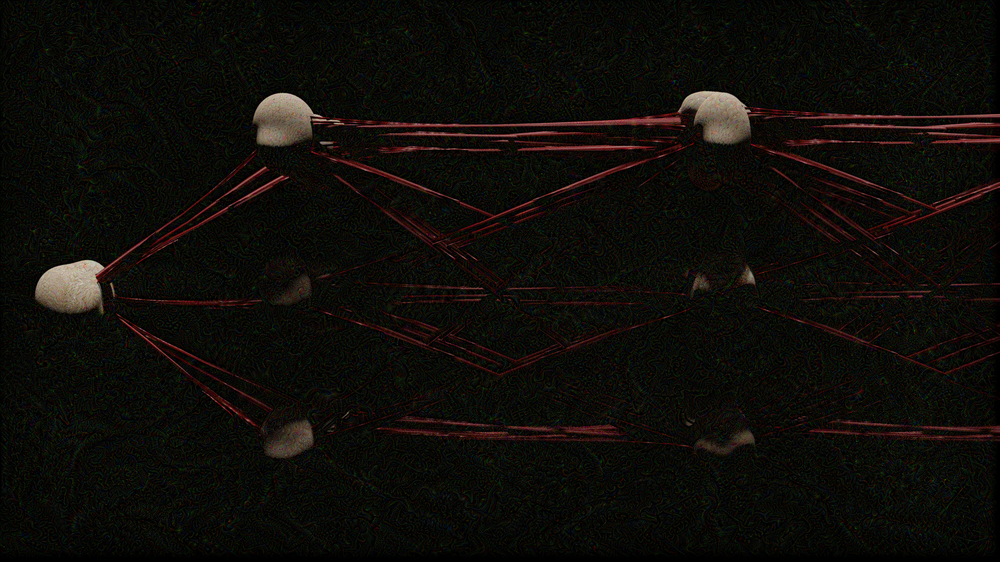   |  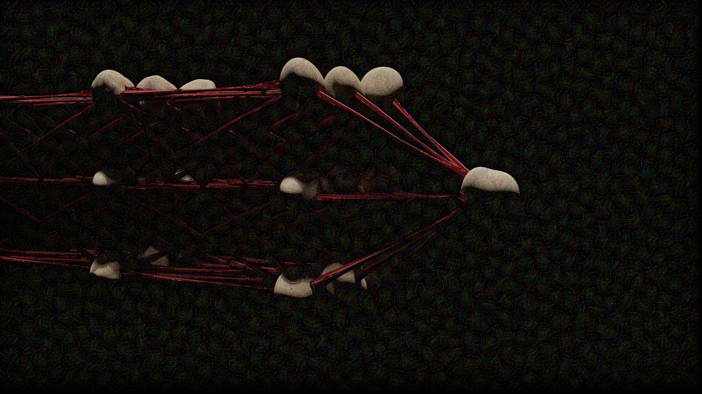 | 


# New Normal

May be it is the time to find the new normal. The [New-Normal](https://opensea.io/tsigoloib/new-normal-3?search[resultModel]=ASSETS&search[sortBy]=LISTING_DATE) collection sum up the Corona virus crisis in simple visualisation. The object combine the Earth with the virus shape. The object is warp with the world's map texture which is intentionally made to be unperfect circle. The protein part of virus penetrate out from the surface to represent the situation that humanity got invaded by the virus. Looking closely the protein stick color are different depends on where the stick located with respect to the world's map.

| | | 
|:-------------------------:|:-------------------------:|
|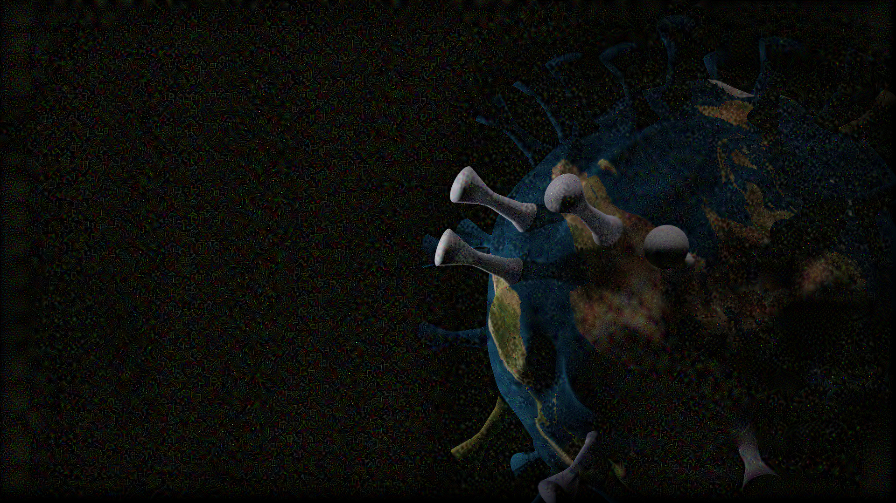   |   | 
| |  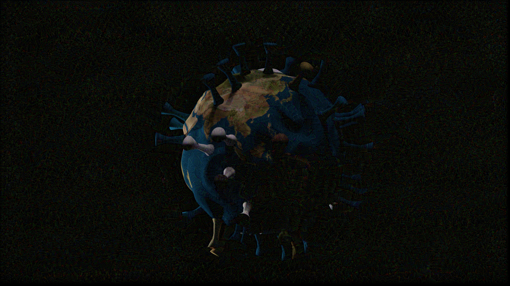| 


# The infected DNA
[The infected DNA](https://opensea.io/tsigoloib/the-infected-dna?search[sortBy]=LISTING_DATE) collection is just random collection created when I want to experience new technique to create spiral/DNA-like structure in Blender. The DNA shape is constructed with 2 spiral shape which are wrap with green dirty like texture. Futuremore, large amount of small particle is also acttach with the core shape to create rough dirty like surface of DNA. If you look closely there are some spiders on the DNA as well.

| | | 
|:-------------------------:|:-------------------------:|
| |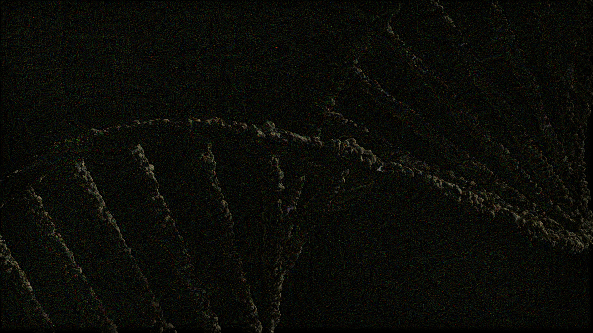   |
|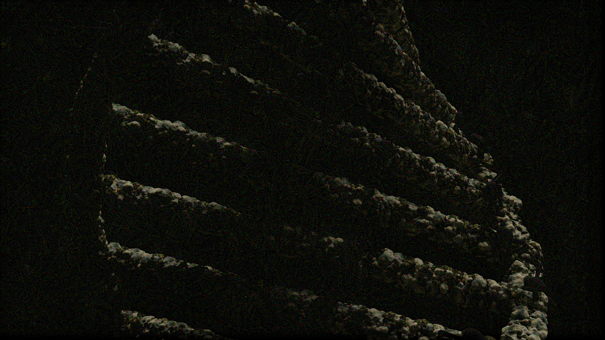   |   


# The second wave of covid19

[The 2nd Wave of Covid19](https://opensea.io/tsigoloib/the-second-wave-of-covid19?search[sortBy]=LISTING_DATE) is the follow up collection from the first Covid19 collection where the overall concept and shape are similar while the main difference is the texture. The overall shape is still the same which is virus, however, not world's map skin wrap anymore. The color used here are red and blue which is spiderman inspired. The main sphere part of object is attched with lots of small blue color particle while the protein part of the virus is attached with the red color particle instead.

| | | 
|:-------------------------:|:-------------------------:|
|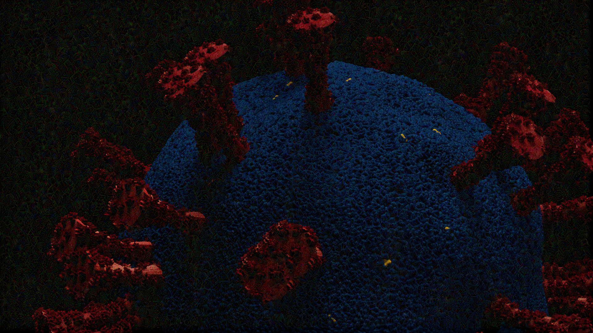 | |
|   |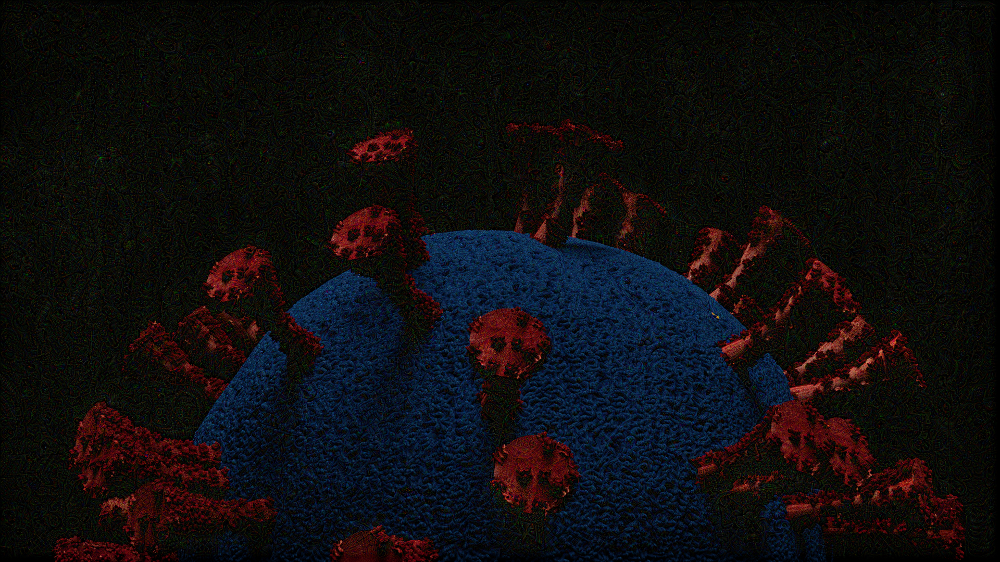   


