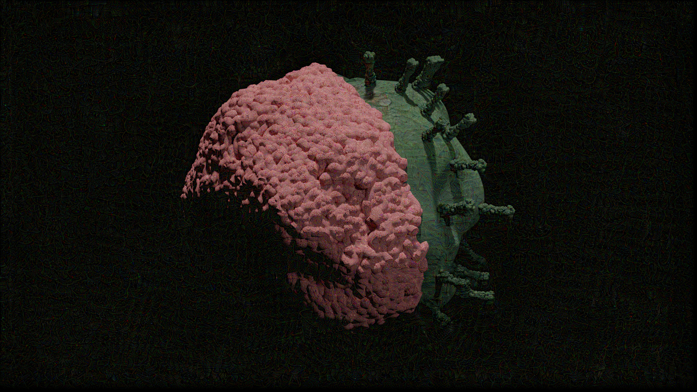
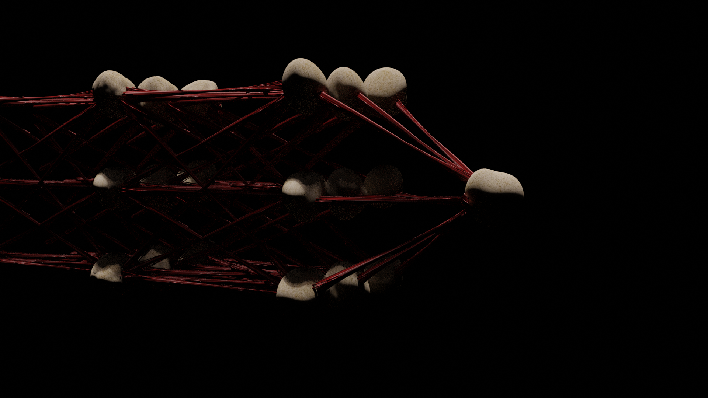

# Deep-Dream

DeepDream is an experiment that visualizes the patterns learned by a neural network. Similar to when a child watches clouds and tries to interpret random shapes, DeepDream over-interprets and enhances the patterns it sees in an image.

The idea in DeepDream is to choose a layer (or layers) and maximize the "loss" in a way that the image increasingly "excites" the layers. The complexity of the features incorporated depends on layers chosen by you, i.e, lower layers produce strokes or simple patterns, while deeper layers give sophisticated features in images, or even whole objects.

The loss is the sum of the activations in the chosen layers. The loss is normalized at each layer so the contribution from larger layers does not outweigh smaller layers. Normally, loss is a quantity you wish to minimize via gradient descent. In DeepDream, you will maximize this loss via gradient ascent.

# Did You Wash Your Hand?
Have I washed my hand? The concept of this collection is to repesent the overthinking about Corona virus. The object used the overall shape of the brain where one side have the realistic-brain pink colour texture while the other side has the green dirty Corona virus texture to represent the feeling that we worried about the virus all the time.
<!---
| | | 
|:-------------------------:|:-------------------------:|
| |  | 
|   |   | 
-->

| | | 
|:-------------------------:|:-------------------------:|
| |  | 
|   |   | 

# Aritificial Intelligence: Oppurtunity or Threat?
Oppurtunity or Threat? The Beginning or the End? The concept of this collection is to question whether the raise of Artificial Intelligence is the future of humanity or the end. The object represent the struture of ANN (Artificial Neural Network) in 3D which is inspired from real neural network inside human brain. Since most of the people view the AI to be the futrue of the humanity, the connection between each neuron is made with red color muscle-like texture to resemble Titan skin (attack on titan) to represent the fearness of AI destroying the humanity. The node itself is created with the bone-like texture, which is also inspired from attack on Titan.
<!---
| | | 
|:-------------------------:|:-------------------------:|
| |  | 
|   |   | 
-->

| | | 
|:-------------------------:|:-------------------------:|
| |  | 
|   |   | 

# New Normal
<!---
| | | 
|:-------------------------:|:-------------------------:|
|   |   | 
| |  | 
-->

This collection sum up the Corona virus crisis in simple visualisation. The object combine the Earth with the virus shape. The object is warp with the world's map texture which is intentionally made to be unperfect circle. The protein part of virus penetrate out from the surface to represent the situation that humanity got invaded by the virus.  

| | | 
|:-------------------------:|:-------------------------:|
|   |   | 
| |  | 

